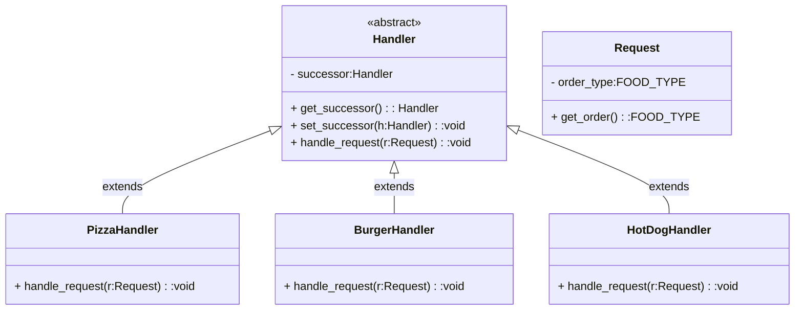

### Chain of responsibility

Avoid coupling the sender of a request to its receiver by giving more than one object a chance to handle the request. Chain the receiving objects and pass the request along the chain until an object handles it.

