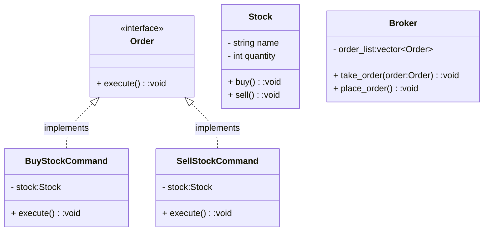

### Command

Encapsulate a request as an object, thereby letting you parameterize clients with different requests, queue or log requests, and support undoable operations. A receiver is defined and will perform the different actions it receives. It involves a common interface with an 'execute' method, concrete  command classes referencing receivers and defining specific actions, and an invoker managing a list of command objects. Clients declare new  receivers, create corresponding command objects, and pass them to the  invoker for execution.

