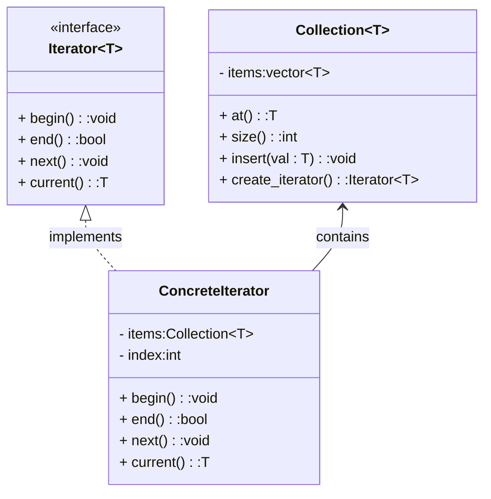

### Iterator

Provide a way to access the elements of an aggregate object sequentially without exposing its underlying representation.

```mermaid
classDiagram
	Iterator~T~ <|.. ConcreteIterator:implements
	Collection~T~ <-- ConcreteIterator:contains
	
	class Iterator~T~ {
		<<interface>>
		+ begin():void
		+ end():bool
		+ next():void
		+ current():T
	}
	
	class Collection~T~ {
		- items:vector~T~
		+ at():T
		+ size():int
		+ insert(val : T):void
		+ create_iterator():Iterator~T~
	}
	
	class ConcreteIterator {
		- items:Collection~T~
		- index:int
		+ begin():void
		+ end():bool
		+ next():void
		+ current():T
	}
```

