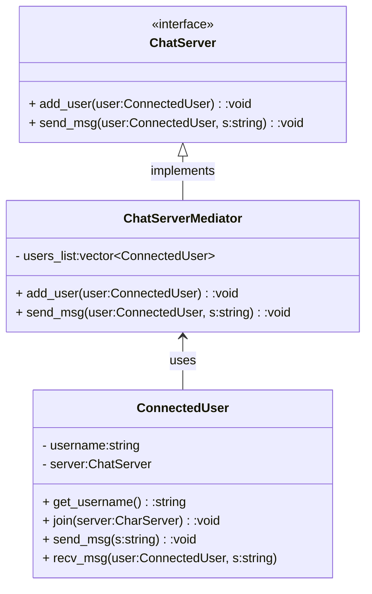

### Mediator

Define an object that encapsulates how a set of objects interact. Mediator promotes loose coupling by keeping objects from referring to each other explicitly, and it lets you vary their interaction independently. The model encapsulates the way in which a set of objects interacts. It promotes weak coupling by preventing objects from explicitly referencing each other, thus allowing their interactions to be varied independently. Its use is aimed at reducing the complexity of communication between several objects or classes. The mediator class manages all communications between the various classes.

