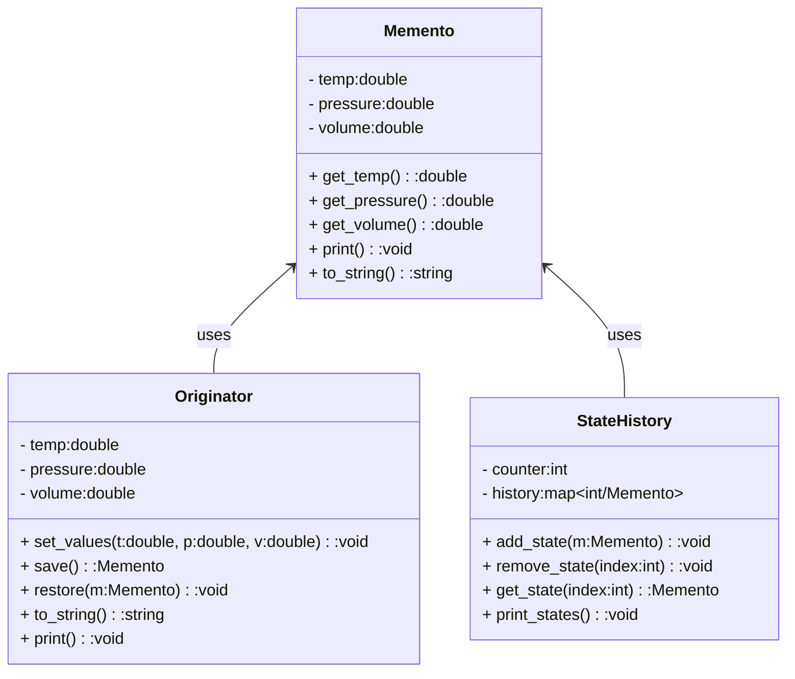

### Memento

Without violating encapsulation, capture and externalize an object's internal state so that the object can be restored to this state later. It is used to store the internal state of an object so that any save state of the object can be restored.

