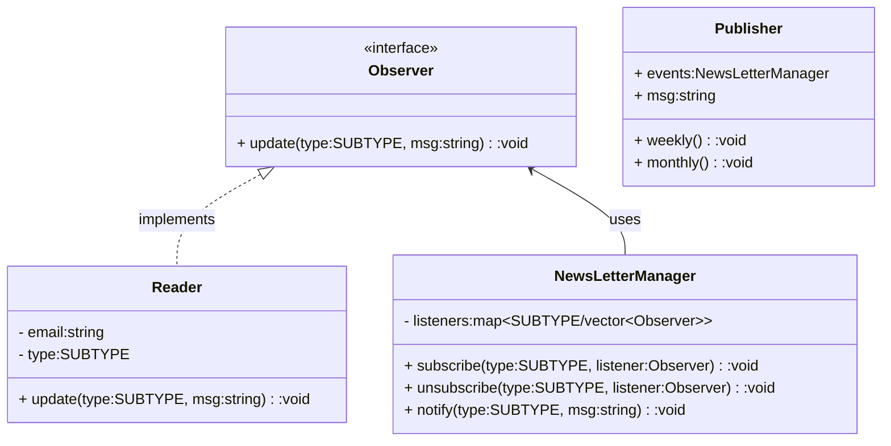

### Observer

Define a one-to-many dependency between objects so that when one object changes state, all its dependents are notified and updated automatically. It provides a way for any object implementing the observer to subscribe and be notified of changes in another object.

