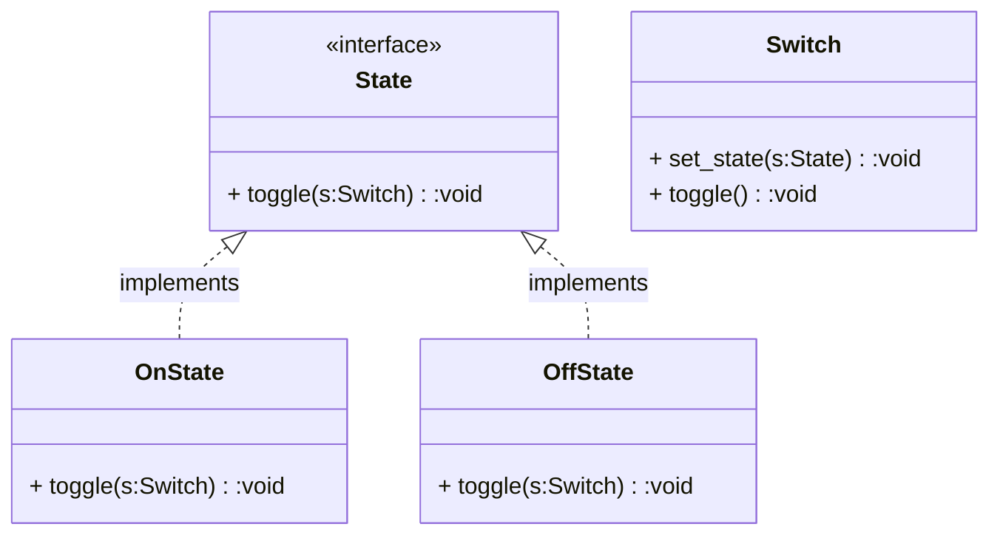

### State

Allow an object to alter its behavior when its internal state changes. The object will appear to change its class. Enable an object to vary its behavior when its internal state changes,  delegating state-specific responsibilities to separate objects. This  enhances modularity and code maintainability, eliminating the need for  multiple conditional clauses.

