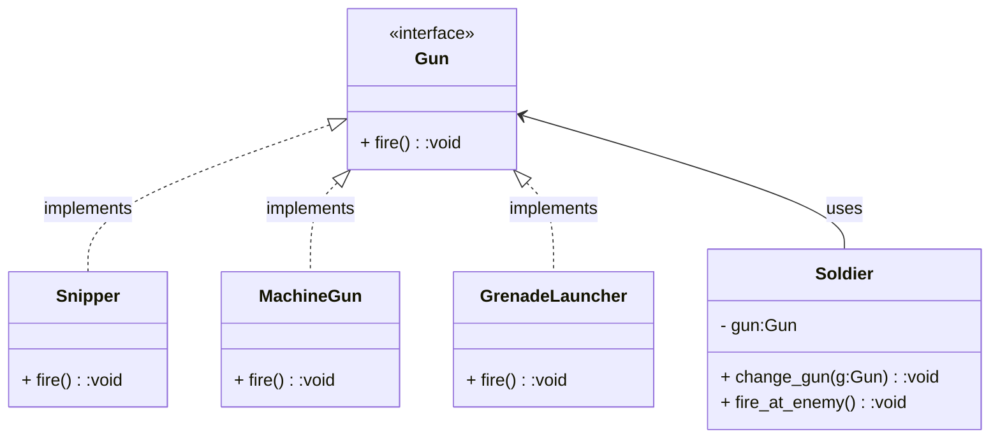

### Strategy

Define a family of algorithms, encapsulate each one, and make them interchangeable. Strategy lets the algorithm vary independently from clients that use it. A common interface defines which method must be implemented in every classes. The "context" class contains a reference to the *Strategy* object and implements behaviours depending on *Strategy* object. When the context object receives request, it delegates to the *Strategy* object to perform appropriate behaviour.

