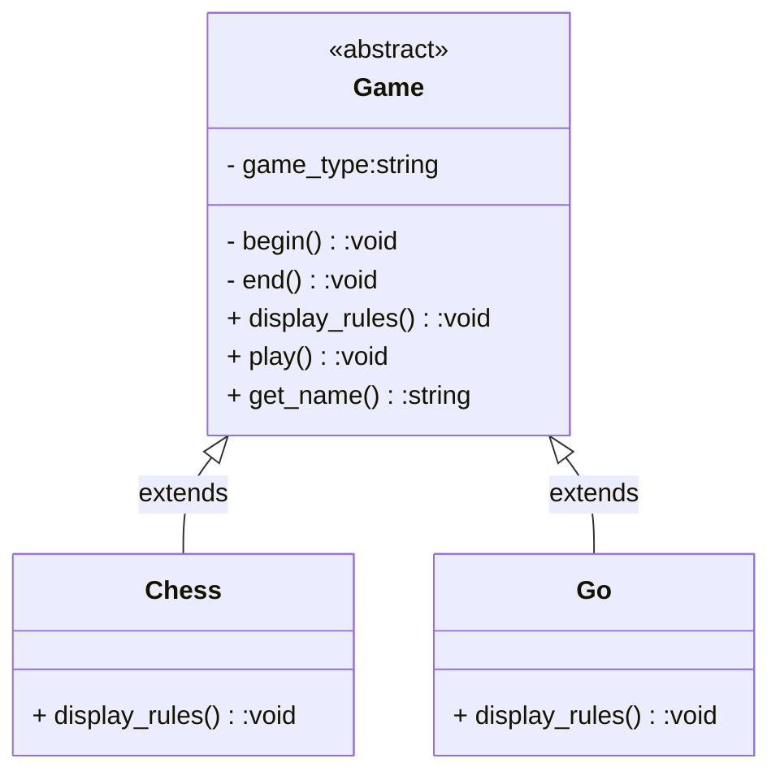

### Template Method

Define the skeleton of an algorithm in an operation, deferring some steps to subclasses. Template Method lets subclasses redefine certain steps of an algorithm without changing the algorithm's structure. The invocation of the algorithm will execute in the order defined by the abstract class.

