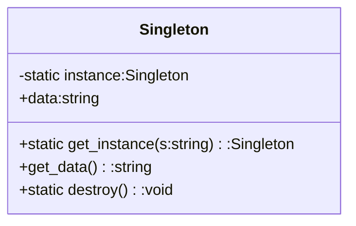

### Singleton

Ensure a class only has one instance, and provide a global point of access to it.

```mermaid
classDiagram

	class Singleton {
		-static instance:Singleton
		+data:string
		+static get_instance(s:string):Singleton
		+get_data():string
		+static destroy():void
	}
```

