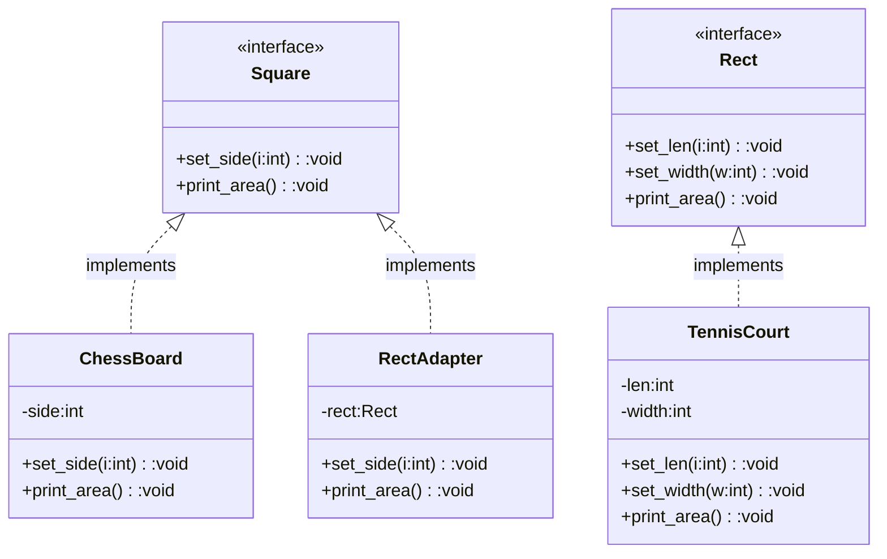

### Adapter

Convert the interface of a class into another interface clients expect. Adapter lets classes work together that couldn't otherwise because of incompatible interfaces.

```mermaid
classDiagram
      Square <|.. ChessBoard:implements
      Rect <|.. TennisCourt:implements
      Square <|.. RectAdapter:implements

      class Square {
      	  <<interface>>
          +set_side(i:int):void
          +print_area():void
      }
      class Rect {
      	  <<interface>>
          +set_len(i:int):void
          +set_width(w:int):void
          +print_area():void
      }
      class ChessBoard {
          +set_side(i:int):void
          +print_area():void
          -side:int
      }
      class TennisCourt {
          +set_len(i:int):void
          +set_width(w:int):void
          +print_area():void
          -len:int
          -width:int
      }
      class RectAdapter {
          +set_side(i:int):void
          +print_area():void
          -rect:Rect
      }
```

