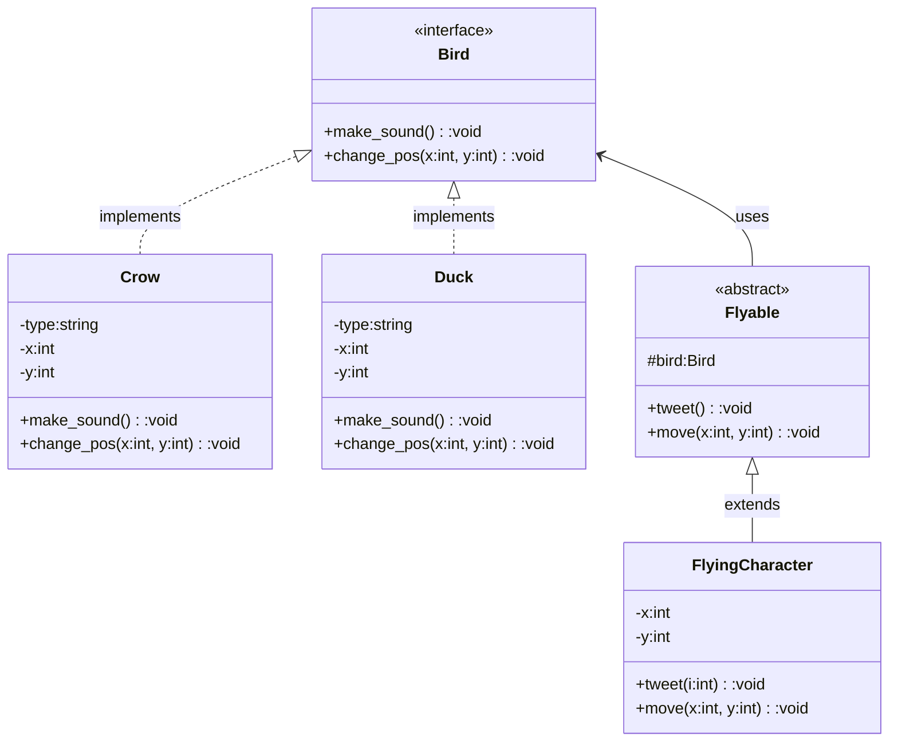

### Bridge

Decouple an abstraction from its implementation so that the two can vary independently. It decouples *abstract* class and implementation classes. Implementations can vary without affecting client code.

