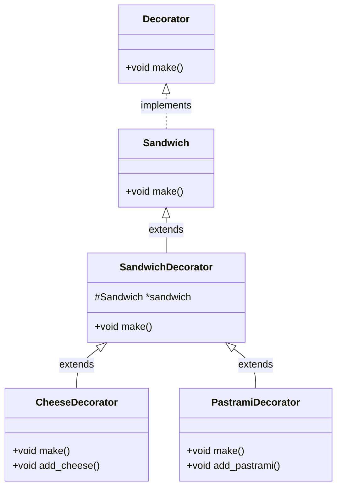

### Decorator

Attach additional responsibilities to an object dynamically. Decorators provide a flexible alternative to subclassing for extending functionality. The Decorator holds an object instance member that can be extended by attaching decorators to it.

