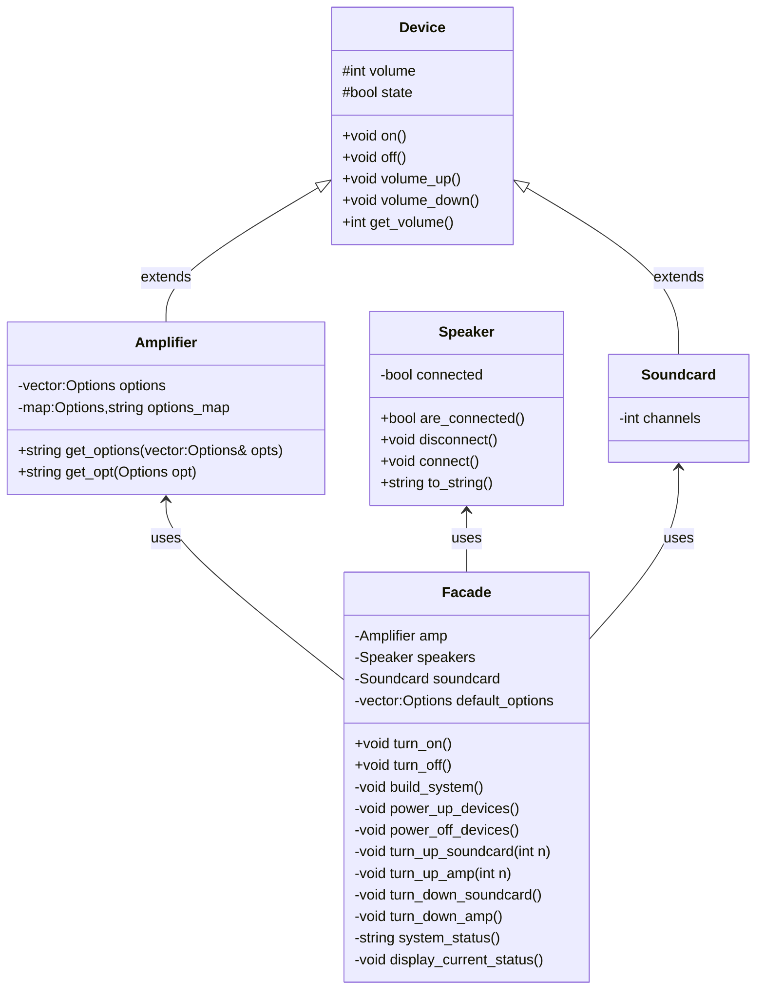

### Facade

Provide a unified interface to a set of interfaces in a subsystem. Facade defines a higher-level interface that makes the subsystem easier to use. Any modification to the subsystem components can be carried out without requiring any modification to the client code, since the latter interacts only with the Facade.

