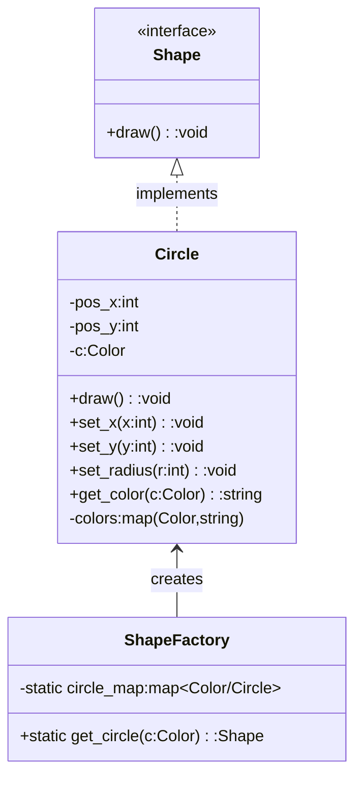

### Fly-Weight

The Flyweight design pattern is used to optimize memory usage by efficiently sharing finite-granular objects. It is particularly useful when we want to create a large number of similar objects by sharing the common parts of their states, rather than storing all the data in each object. A Flyweight object can represent many 'virtual' instances, enabling more efficient use of resources.

